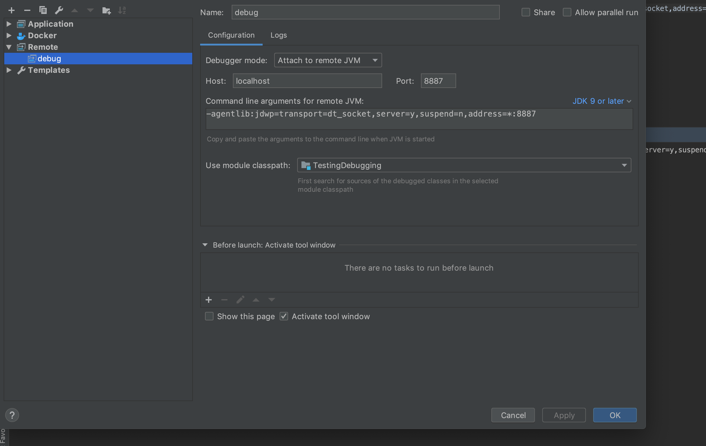

Debugging Java applications inside a container in intellij. 

Its very easy only contains two steps 

   1. Run your java application with this option 
        
            -agentlib:jdwp=transport=dt_socket,address=8787,server=y,suspend=n
        
        In this project if you run make debug it will do that for you
     
   2. On intellij  create a remote configuration that looks like the diagram below 
    
  
  
  
  
Note that the container should expose the same port configured in your remote debug configuration 